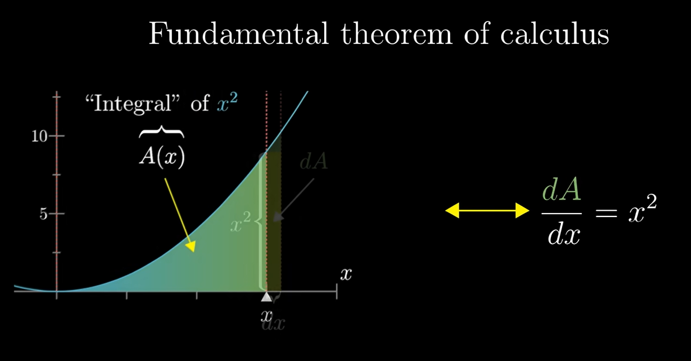

## Essence of Calculus

### Derivatives

The derivative of a function at a point measures how the function's output changes as its input changes. It is defined as the limit of the average rate of change of the function over an interval as the interval approaches zero. Its shows the sensitivity of the function's output to small changes in its input.

### Integrals

An integral is a mathematical concept that represents the accumulation of quantities, such as area under a curve, total distance traveled, or accumulated value over time. It is the reverse operation of differentiation and is used to calculate the total effect of a continuously changing quantity.

### Fundamental Theorem of Calculus

The Fundamental Theorem of Calculus connects the concepts of differentiation and integration. It states that if a function is continuous on an interval, then its definite integral over that interval can be computed using its antiderivative. Specifically, if F is an antiderivative of f on [a, b], then the definite integral of f from a to b is given by F(b) - F(a).

### Formula of derivative

- The derivative of a constant function is zero: d/dx[c] = 0
- The derivative of a power function: d/dx[x^n] = n*x^(n-1) 
  - --> Great explanation here about how its tied to area change and slope. https://www.youtube.com/watch?v=S0_qX4VJhMQ
  - eg. derivate of d/dx[x^3] = 3*x^2 and that of d/dx[x^2] = 2*x