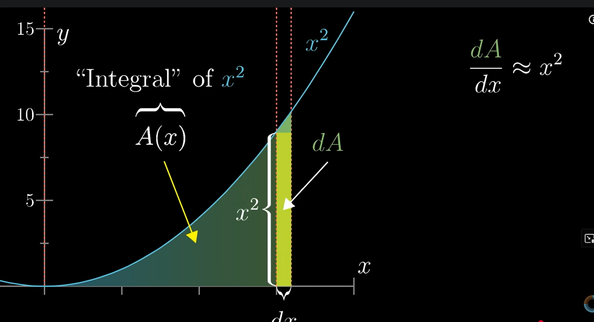

## Derivatives

The derivative of a function at a point measures how the function's output changes as its input changes. It is defined as the limit of the average rate of change of the function over an interval as the interval approaches zero. Its shows the sensitivity of the function's output to small changes in its input.

