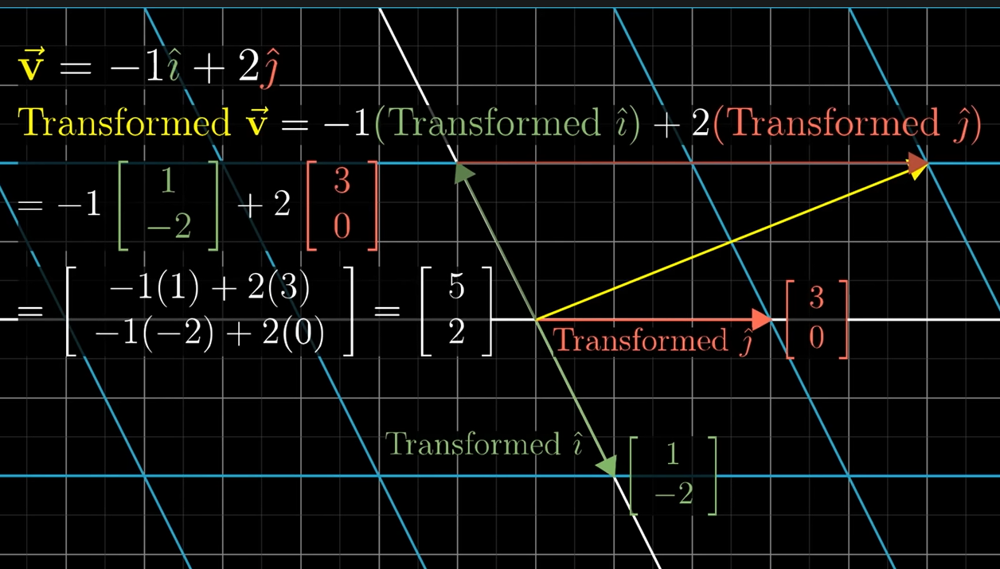
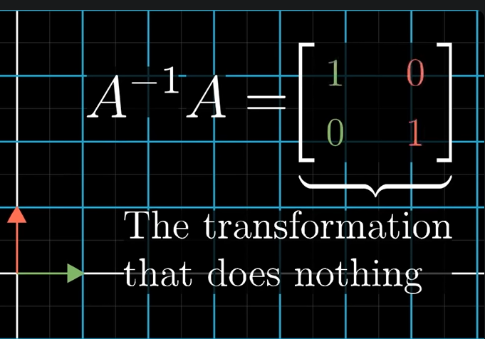
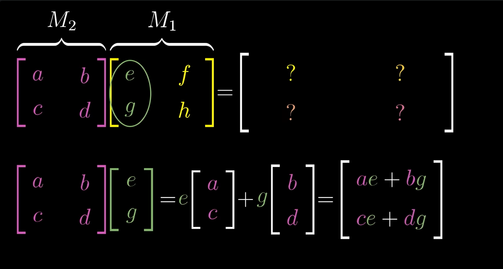
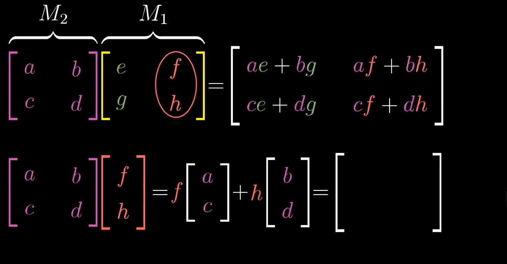

# Essence of Linear Algebra 

- Source: https://www.youtube.com/watch?v=XkY2DOUCWMU

## Vectors

1. Just an line in x and y axis or coordinate system
2. Origin is root of all vectors
3. Coordinates are just distances from origin along each axis
4. Vectors can be added together by adding their coordinates
5. Multiplication by a scalar stretches or shrinks the vector. Multiplying by negative flips the direction.
   1. Example: -1[3, 4] = [-3, -4]
6. Scaling a vector changes its magnitude but not its direction. 2[3, 4] = [6, 8]

## Span of Vectors

1. Span is all possible combinations of a set of vectors
2. If two vectors are not collinear, they span a plane
3. If three vectors are not coplanar, they span a 3D space
4. If vectors are collinear or coplanar, they do not span the full space
5. Eg, [3, -2] is basically the same as [6, -4] in terms of span since one is just a scaled version of the other. [3, -2] can be represented as 3i + -2j where i and j are unit vectors along x and y axis respectively.
6. The basis of a vector space is the minimum set of vectors needed to span the space. In 2D, two non-collinear vectors form a basis. In 3D, three non-coplanar vectors form a basis.
7. Linearly independent vectors are vectors that cannot be represented as a combination of other vectors in the set. They are essential for forming a basis. Each vector adds a new dimension to the span. Example: In 2D, [1, 0] and [0, 1] are linearly independent and form a basis for the 2D space.
8. Linear dependence occurs when one vector can be expressed as a combination of others. For example, in 2D, [6, -4] is linearly dependent on [3, -2] since it can be obtained by scaling it by 2.

## Matrices as Linear Transformations

1. Linear transformations map vectors from one space to another while preserving vector addition and scalar multiplication. Its basically a function that takes in a vector and outputs another vector.
2. The word transformation is used to indicate that the matrix changes the vector in some way, such as rotating, scaling, or shearing it.
3. A 2x2 matrix can transform 2D vectors, while a 3x3 matrix can transform 3D vectors.
4. Linear Algebra only cares about Linear Transformations. Lines remain lines and origin remains fixed. Linear transformations would map to lines and not curves.

5. In this image, you can deduce that the new transformed coordinates of the basis vectors are:
   1. i' = [1, -2]
   2. j' = [3, 0]
With this, you can deduce where v' lands with v =-1i + 2J
which comes out to be v' = -1[1, -2] + 2[3, 0] = [5, 2]

6. This shows that the matrix that produces this transformation is:
   1. [1 3]
   2. [-2 0]
The first column is where i' lands and second column is where j' lands. i' is pronounced i hat and j' is pronounced j hat.

7. Basically, if you are given a matrix, you can deduce where the basis vectors land and then use that to deduce where any vector lands after transformation. In above example, if you are given new vector [5, 7], you can deduce where it lands after transformation by first expressing it in terms of basis vectors:
   1. 5i + 7j
   2. Then applying the transformation:
   3. 5[1, -2] + 7[3, 0] = [26, -10]

8. Simple formula
   

   [x] [a b] = x[a]  + y[b]  = ax + by
   [y] [c d]    [c]     [d]    cx + dy

9. For counter-clockwise rotation of 90 degrees, the matrix is: Initially i' was in [1, 0] and j' was in [0, 1]. After rotation, i' lands in [0, 1] and j' lands in [-1, 0]. So the matrix is:
   1. [0 -1]
   2. [1 0]

## Matrix Multiplication

1. Matrix multiplication is not element-wise multiplication. Its a composition of linear transformations.
2. When multiplying two matrices, the number of columns in the first matrix must equal the number of rows in the second matrix.
3. The resulting matrix has dimensions equal to the number of rows in the first matrix and the number of columns in the second matrix.
4. To compute the element at row i and column j of the resulting matrix, take the dot product of row i from the first matrix and column j from the second matrix.
5. Matrix multiplication is associative but not commutative. That is, (AB)C = A(BC) but AB ≠ BA in general.
6. Example:
   1. A = [1 2]   B = [3 4]
          [3 4]        [5 6]
   2. AB = [1*3 + 2*5   1*4 + 2*6] = [13 16]
            [3*3 + 4*5   3*4 + 4*6]   [29 36]

7. Graphic Explanation
8. 

9. Matrix Multiplication is associative
   Example: (AB)C = A(BC)
   1. A = [1 2]   B = [3 4]
          [3 4]        [5 6]
      C = [7 8]
          [9 10]

### Three dimensional transformations

1. In 3D, we have three basis vectors: i, j, k
2. A 3x3 matrix can represent linear transformations in 3D space.
3. A 3 by 3 matrix has 9 elements, each representing how much of each basis vector contributes to the transformed basis vectors.
4. Example, the matrix:
   1. [1 0 0]
   2. [0 1 0]
   3. [0 0 1]
5. Rotate this example by 90 degrees around the z-axis:
   1. [0 -1 0]
   2. [1 0 0]
   3. [0 0 1]
6. To see where a vector lands after transformation, express it in terms of basis vectors and then apply the transformation.
7. Example: v = 2i + 3j + 4k. In this case [x, y, z] = [2, 3, 4], in matrix terms that is [2]
                                                                                           [3]
                                                                                           [4]
   1. v' = 2[0, 1, 0] + 3[-1, 0, 0] + 4[0, 0, 1] = [-3, 2, 4]
8. In picture format
   

9. Example of multiplication of 3 matrix.
10. A = [1 2 3]   B = [4 5 6]   C = [7 8 9]
          [0 1 4]        [0 1 0]        [1 0 1]
          [5 6 0]        [7 8 9]        [0 1 0]
11. First compute AB:
    1. AB = [1*4 + 2*0 + 3*7   1*5 + 2*1 + 3*8   1*6 + 2*0 + 3*9] = [25 36 39]
             [0*4 + 1*0 + 4*7   0*5 + 1*1 + 4*8   0*6 + 1*0 + 4*9]   [28 33 36]
             [5*4 + 6*0 + 0*7   5*5 + 6*1 + 0*8   5*6 + 6*0 + 0*9]   [20 31 30]

### The Determinant