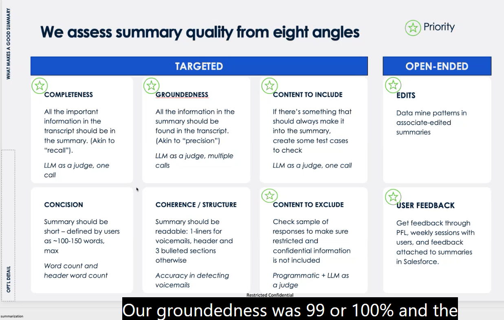
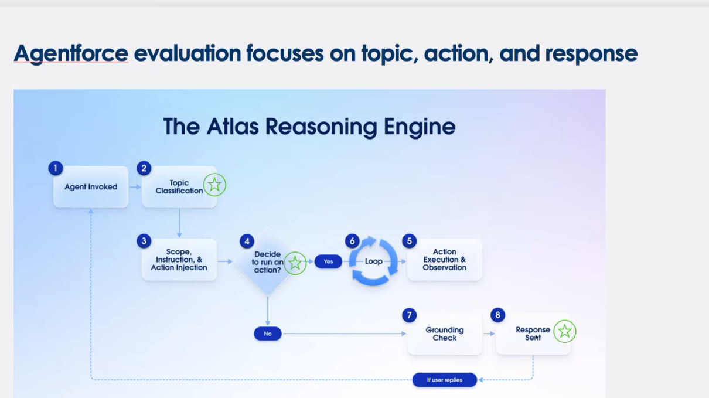
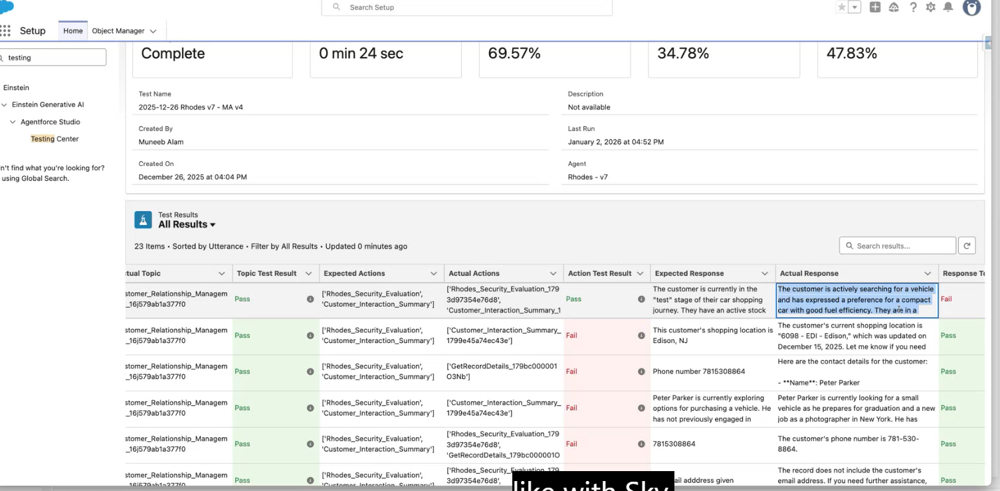
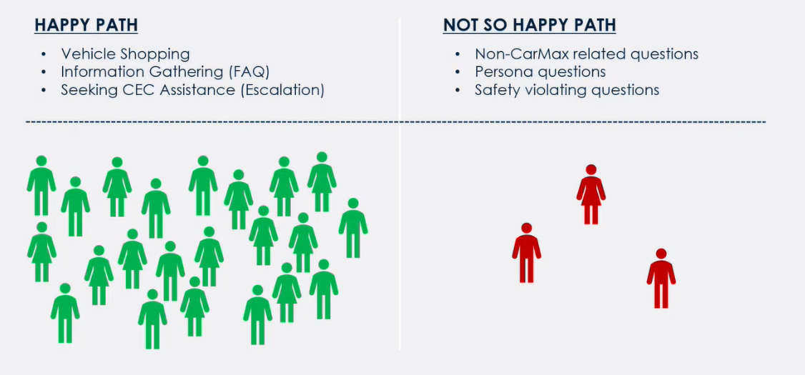
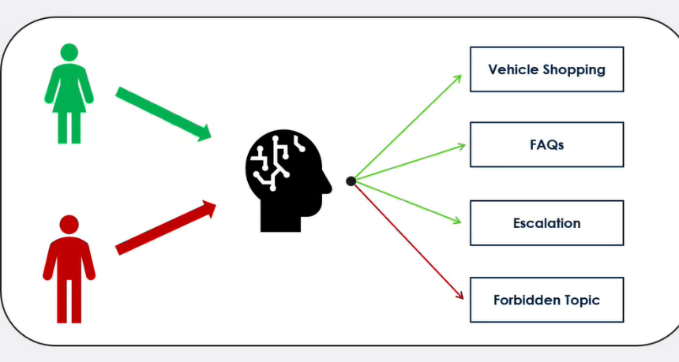
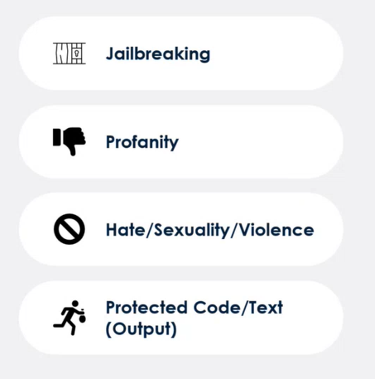
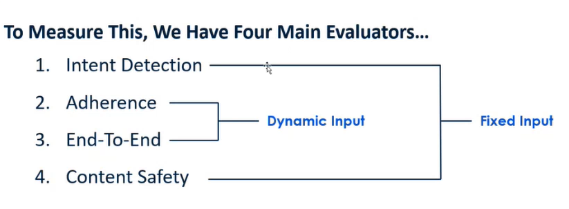

## LLM summarization Evaluation Criteria

When evaluating the performance of Large Language Models (LLMs) in summarization tasks, several key criteria should be considered:. Eg, when LLM summarizes a call transcript from customer

## Evaluation the LLM actions

Example:

## Chatbot example, getting questions you dont want

1. You do intent detection on the user query

2. Content Safety layer - Azure provided for example
   1. 
3. Four main evaluation layers
   1. 