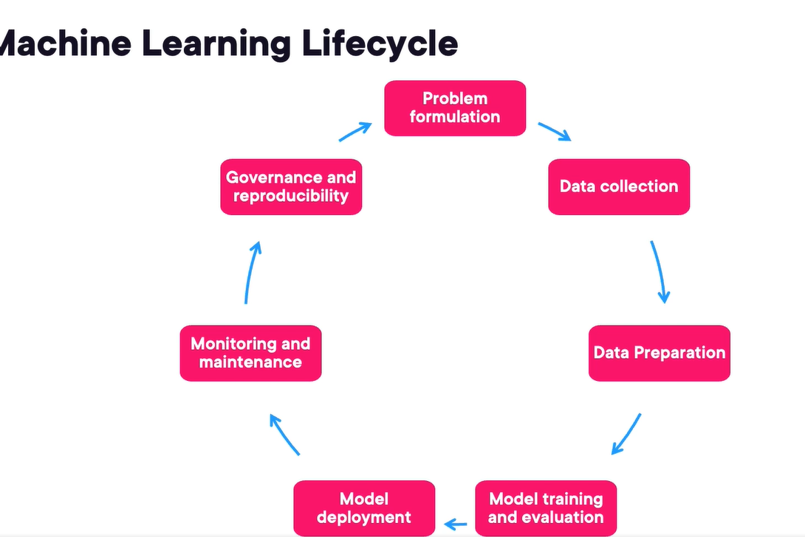
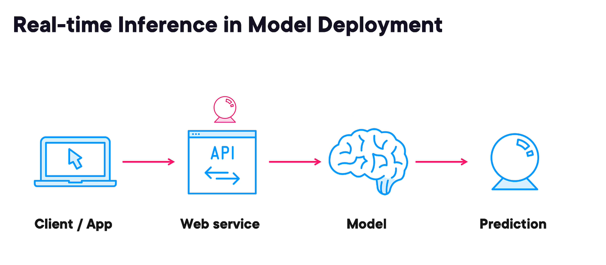
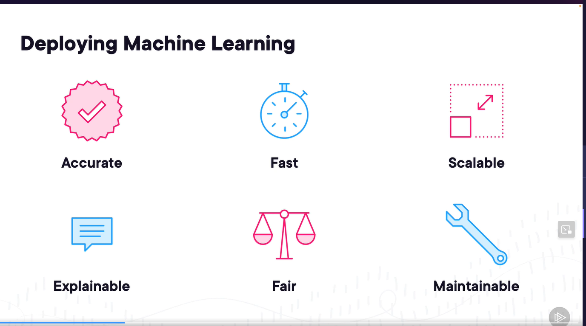
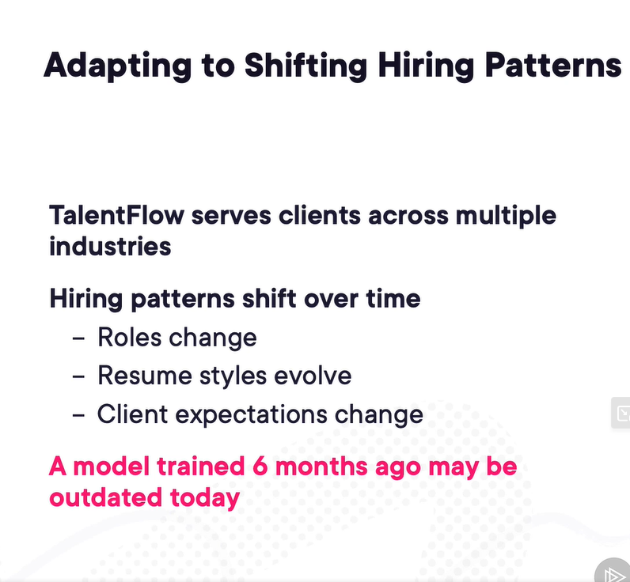

# First Course of Machine Learning Path - Foundations of Machine Learning

https://app.pluralsight.com/ilx/video-courses/machine-learning-engineering-foundations/course-overview

## The Machine Learning Workflow

1. Predicting house prices, predicting how long a task takes - Regression
2. Find patterns without labels - Clustering. Eg, grouping customers by purchasing behavior
3. Recommending actions - Collaborative filtering
4. Classifying images, spam detection - Classification

### Machine Learning Engineering

1. Accuracy - How well does the model perform over time?
2. Precision - When it predicts positive, how often is it correct?
3. Recall - Of all actual positives, how many did we correctly identify?
4. F1 score - Balance between precision and recall. Harmonic mean of precision and recall.
5. Eg. for plane maintenance, recall is more important than precision. We want to catch all potential failures, even if it means some false alarms.
6. Latency - Time taken to make a prediction. How quickly the model make prediction. Eg, stock market predictions need low latency.Self driving cars need low latency. Zone intrusion detection systems need low latency.Detecting medical conditions in real-time need low latency.
7. Throughput - Number of predictions per second
8. Scalability - Ability to handle increasing data volume and user requests
9. Fairness - Avoiding bias against certain groups. Especially critical domains like hiring, lending, law enforcement, healthcare
10. Explainability - Understanding how the model makes decisions. Important for trust and regulatory compliance. Why did the model make certain predictions?
11. Reliability - Consistent performance over time. Robustness to data changes and edge cases.

### Machine Learning Lifecycle

1. Problem Formulation - Define the problem and objectives
2. Data Collection - Gather relevant data and how can we get it
3. Data Preparation - Clean and preprocess data, labelling, transforming data
4. Model training and evaluation - Select algorithms, train models, evaluate performance, validate performance
5. Model Deployment - Integrate model into production environment
6. Monitoring and Maintenance - Track performance, retrain as needed, handle data drift
7. Governance and reproducibility - Ensure compliance, document processes, model version control, auditing etc for compliance.

#### Example

1. Problem Formulation - Company needs assistant to help hire proper candidate. Best candidates are ones that stay 1 year and have great evaluations.
2. Data Collection - Collect historical hiring data, resumes, performance evaluations, tenure dat
         a. Data can come from APIs, internal database, web scraping etc, data availability and permissions
         b. Model learns from examples, requires lableled data
         c. Each record includes input + expected output.
         d. Example on that company would be a resume paired with a performance score. When a new client signs up, you gather past resumes, interview notes, job descriptions, employee retention metrics, performance reviews etc.

3. Data Preparation
        a. Clean data, handle missing values by filling in, remove duplicates, correctness, remove PII data
        b. Normalizaiton and encoding - eg, coverting text to lower case, normalizing numerical skills and dates, encoding categorical variables
        c. Feature Extraction and transformation - Extract relevant features from resumes like skills, experience, education. Transform text data into numerical representations using techniques like TF-IDF or word embeddings.
        d. Handle sensitive data - anonymize or remove or encrypt personally identifiable information (PII) to ensure privacy compliance.
        e. Split data into training, validation, and test sets to evaluate model performance effectively.

4. Transformation
        a. Resumes might be processed using NLP techniques to extract skills, experience, education, job titles etc
        b. Interview notes converted into numeric scores
        c. Retention might be encoded as a binary label - stayed more than 1 year(1) or not(0)

5. Splitting Data 
        a. Training set - 70% of data to train the model
        b. Validation set - 15% to tune hyperparameters and select best model
        c. Test set - 15% to evaluate final model performance
6. This entire process needs to be repeatable and automated as when new clients come in, the whole pipeline needs to be rerun with new data.
        a. These pipelines can be built using tools like Apache Airflow, Kubeflow, or cloud-based services like AWS Step Functions or Azure Data Factory, dbt or python scripts
        b. This is a very critical step. If data is not prepared well, things can fail silently in production

### Model Development, Training and Evaluation

1. Select a model

2. Select appropriate algorithms - classification algorithms like linear regressions, logistic regression, decision trees, random forests, gradient boosting, SVMs(Support Vector Machines), neural networks

3. Selecting model depends on data size, feature types, interpretability needs, computational resources, performance.

4. You also have to chose evaluation metrics - accuracy, precision, recall, F1 score etc

5. Example if model says only 1 out of 100 candidates is good, the model predicts everyone as unsuccessful still gets 99% accuracy. So accuracy is not a good metric here. Precision and recall are better.

6. Hyperparameter tuning - adjusting learning rate, regularization strength, tree depth, number of estimators etc. Example max depth of decision tree controls complexity. Higher depth can lead to overfitting, too shallow can lead to underfitting (may miss patterns)

7. Cross-validation - splitting training data into multiple folds to validate model performance across different subsets. Helps ensure model generalizes well to unseen data. Goal is to avoid overfitting. It checks if model generalizes, not just memorizes

8. Overfitting - model learns noise and details from training data too well, performs poorly on new data. Happens when model is too complex relative to data size/quality and fails to generalize the lessons learned
9. Underfitting - model is too simple to capture underlying patterns in data, performs poorly on both training and new data. Happens when model lacks complexity or insufficient training.

10. Best performing model is not just the one with the highest score. Its the one that balances performance with interpretability, latency, scalability, fairness, reliability etc based on requirements.

11. Model is trained iteratively, once it looks good, its ready to be deployed to production

### Model Deployments

1. Model deployment involves integrating the trained model into a production environment where it can make real-time or batch predictions on new data.
2. Deployment is not the end of the journey. Once deployed, the model needs to be monitored and maintained to ensure it continues to perform well over time.

3. Real-time inference - model serves predictions via APIs or microservices. Low latency is critical for applications like fraud detection, recommendation systems, self-driving cars etc.
4. Batch inference - model processes large volumes of data at scheduled intervals. Suitable for scenarios like generating reports, updating recommendations, periodic data analysis etc. Off hours, lower compute cost. More efficient to scale for large data sets.
5. Monitoring and Maintenance
   a. Monitor model performance using metrics like accuracy, precision, recall, F1 score etc
   b. Track data drift - changes in input data distribution that can impact model performance 
   c. Retrain model periodically with new data to maintain accuracy and relevance
   d. Implement alerting mechanisms to notify when performance drops below acceptable thresholds
   e. Maintain version control for models to track changes and roll back if needed
   f. Ensure compliance with governance policies and regulations throughout the model lifecycle
   g. Track inputs and outputs for auditing and reproducibility
   h. Measure prediction latency and throughput to ensure performance meets requirements
   i. Is the model still peforming well, is it making predictions within the expected latency, has the input data changed significantly?
   j. Prediction Distribution -- Are the scores drifting over time?

### Model VErsioning and Governance

1. Model versioning involves tracking different versions of the model, including changes to architecture, hyper-parameters, training data etc. What data uses, what hyper-parameters were used, when was it trained, who trained it , what metric scores achieved etc.

2. Tools like MLflow, DVC, or cloud-based services like AWS SageMaker Model Registry, Azure ML Model Registry can help manage model versions effectively.

3. You can also track commitId, model hashset etc.

## Challenges in Machine Learning

1. 
2. Fairness and Compliance - Ensuring models do not exhibit bias against certain groups and comply with regulations like GDPR, HIPAA etc.
3. Interpretability - Understanding how models make decisions, especially for complex models like deep learning.
4. Explainability - Providing clear explanations for model predictions to build trust with stakeholders.
5. Maintability - Keeping models up-to-date with changing data and requirements. Models may need to be retrained to stay accurate.\
6. Engeering TradeOffs - The most accurate model might be too slow, fastest model might lack interpretability. Balancing accuracy, latency, scalability, interpretability, fairness etc based on requirements. The fairness model might sacrifice some predictive power

### Feature Engineering

1. Feature engineering is the process of selecting, transforming, and creating features from raw data to improve model performance.
2. Good features can significantly enhance model accuracy and generalization.
3. Common techniques include normalization and scaling, encoding categorical variables (eg. 0, 1, 2 for enum types), handling missing values(remove missing ones, fill in with average etc), feature extraction, dimensionality reduction etc.
4. Feature selection involves identifying the most relevant features for the model, reducing noise and improving interpretability.
5. Feature Creation involves generating new features from existing ones, such as combining multiple features or deriving new metrics. Example, creating a "years of experience" feature from a "start date" and "end date" feature.
6. Dimensionality Reduction techniques like PCA (Principal Component Analysis) can help reduce the number of features while retaining important information. This makes model faster and sometimes even more accurate by removing noise.v
7. Feature engineering is an iterative process that requires domain knowledge, experimentation, and validation to identify the most effective features for the model. Its not a one time task, you try, train, evaluate and adjust. Some features may be useless, others might unlock new patterns. You keep iterating until you find the best set of features for your model. This makes your model robust and effective.

### Explainability and Bias

1. Explainability is the ability to understand and interpret how a machine learning model makes decisions.
2. Global Explainability - Understanding overall model behavior and feature importance. Techniques like SHAP (SHapley Additive exPlanations) and LIME (Local Interpretable Model-agnostic Explanations) can help explain complex models.
3. Local Explainability - Understanding individual predictions and why the model made a specific decision for a given input.
4. SHAP - breaks down a prediction and shows how much each feature contributed to a final decision
5. LIME - creates a simple interpretable models that approximates the complex model locally around a specific prediction
6. Sometimes team chose a simple models like decision trees or linear regression for better interpretability, even if they sacrifice some accuracy.
7. What causes bias?
   a. Biased training data - if training data is not representative of the real world, model may learn and perpetuate existing biases
   b. Sensitive attributes influence outcomes
        c. Algorithmic bias - certain algorithms may inherently favor certain groups or outcomes
        d. Some groups are underrepresented in training data
        e. Labels or features are recorded inconsistently across groups
8. Mitigating Bias
   a. Diverse and representative training data
   b. Fairness metrics to evaluate model performance across different groups
   c. Techniques like re-sampling, re-weighting, adversarial debiasing etc

### Handling Model Degradation and Drift

1. Data Drift - The world changed but model stays trained on the old data. Eg. trend changes, seasonality, new user behaviors etc
   1. Eg. New resume styles and terminology in resumes for hiring model
2. Concept Drift - The underlying relationships between features and target variable change over time. Eg. new regulations, market shifts, technological advancements etc
   1. Eg. Hired candidates differ from model predictions due to changes in company culture or job market conditions
3. If not monitored for these, you will see a drop in model performance over time
4. Monitoring continuously is critical to detect drift early. Track prediction distributions, input data statistics, model accuracy. Use automated alerts and dashboards.
   1. Review batches of predictions periodically to identify anomalies or shifts in performance.
5. If domain changes, retraining can be planned periodically or triggered by drift detection.

6. When drift is detected, retrain model with recent data to restore performance.
7. Implement robust data pipelines to ensure consistent data quality and preprocessing over time.