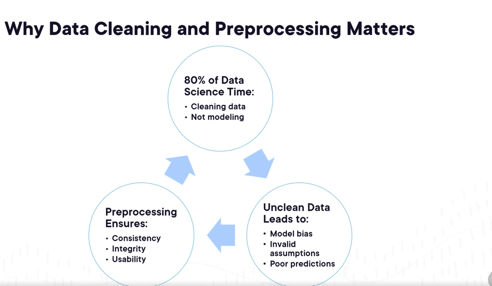
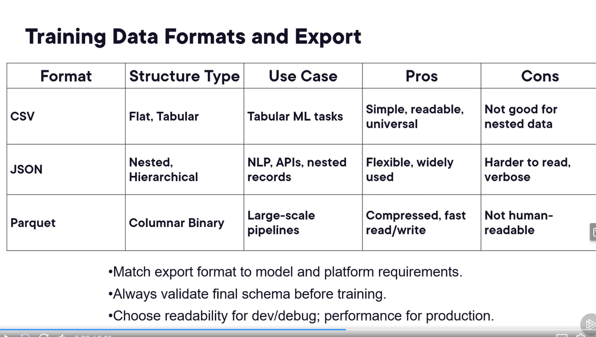
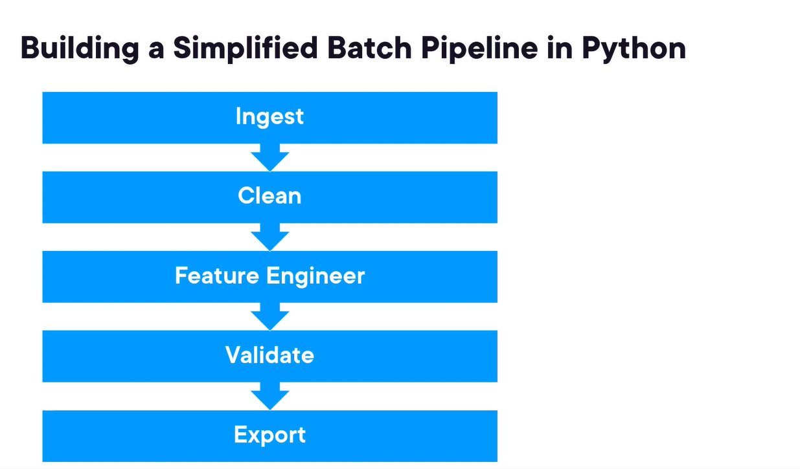

# Data Engineering for Machine Learning

## Introduction

1. Data Collection: Gather from API, logs, databases etc
2. Cleaning: Remove duplicate, inconsistent, or irrelevant data points.
3. Preprocessing:is to transform raw data into an understandable format for the model. Example, handling missing values, normalization, encoding categorical variables.
4. Validation: Ensure data quality and integrity by checking for errors, data types and ranges
5. **80 Percent of ML work is Data Engineering as that is the foundation of the how model will perform**

## Pandas

Pandas is a powerful library for data manipulation and analysis in Python. It provides data structures like DataFrames and Series that make it easy to handle and analyze structured data. Helps in data cleaning, transformation, and exploration.

## Numpy

NumPy is a fundamental library for numerical computing in Python. It provides support for arrays, matrices, and a wide range of mathematical functions to operate on these data structures efficiently. In machine learnings, NumPy is used for numerical operations, linear algebra, and handling large datasets to capture numerical features

## Ydata-profiling

Ydata-profiling is a Python library that generates detailed reports from a pandas DataFrame. It provides insights into the data, including distributions, correlations, missing values, and summary statistics. This helps in understanding the dataset and identifying potential issues before building machine learning models.

## Importance of Data Cleaning And Preprocessing

1. Missing values: Handle missing data by imputation or removal to prevent bias.
2. Duplicates: Remove duplicate records to avoid skewed analysis.
3. Normalization: Scale features to a common range for better model performance.

Domain knowledge and understanding of the data is crucial for effective cleaning and preprocessing. For example, if weather value is missing, instead of using global average, it might be better to use mean of that region. If there are outliers, for example, spike in sensor reading, that spike might be important outlier to consider.

Categorical groupings: For example, in a dataset with job titles, grouping similar titles (e.g., "Software Engineer" and "Developer") can help reduce dimensionality and improve model performance.

## Data Validation And Preparation for Training

1. Data Validation ensures input data meets the required quality standards before model training.
2. Data validation helps avoid errors like incorrect data types, missing values(empty cells), or out-of-range(date of birth in future) values that can lead to poor model performance. For example, "thirty" instead of 30 for age.
3. It reduces overfitting by ensuring the training data is representative of real-world scenarios. It also reduces unexpected behavior

### Common Validation Checks and Tools

1. Type Checking: Ensure data types match expected formats (e.g., integers for counts, floats for decimals, strings).
2. Range Validation: Verify numerical values fall within acceptable ranges (e.g., age between 0 and 120).
3. Null checks and handlings
4. Unique vs duplicate value checks
5. Value distribution anomalies: Eg, income values mostly under 100k but few listed in millions!

### Tools

- Pandas
- ydata-profiling
- export Json/CSV and Parquet are some good training data formats and export

## Data Ingestion

1. Batch Ingestion: Data is collected and processed in batches at scheduled intervals. This is suitable for scenarios where real-time processing is not required. Example, daily reports, system backups, latency is high. Pandas, Apace Nifi, Airflow are good tools for this.
2. Real-Time Ingestion: Data is collected and processed in real-time as it is generated. This is suitable for scenarios where immediate insights or actions are required, such as monitoring systems or live dashboards. Example, sensor data, user interactions, latency is low. Kafka, Spark Streaming, Flink are good tool for this.
3. ETL (Extract, Transform, Load): ETL is a process that involves extracting data from various sources, transforming it into a suitable format, and loading it into a target system, such as a data warehouse or a database. ETL is commonly used for batch processing and data integration tasks.
4. ELT (Extract, Load, Transform): ELT is a process similar to ETL, but the transformation step occurs after the data is loaded into the target system. This approach is often used in modern data architectures where the target system, such as a data lake or cloud data warehouse, can handle large-scale transformations efficiently. This is good to handle like logs, streams etc that does not directly fit into predefined schema
5. Automation and Error Handling is the key for data processing. Monitoring and alerting mechanisms should be in place to detect and respond to issues promptly. Tools like Airflow, Prefect, and Dagster can help automate workflows and manage errors effectively.

## Feature Engineering

Feature engineering is the process of creating new features or modifying existing features to improve the performance of machine learning models. It involves transforming raw data into meaningful representations that capture important patterns and relationships.

### Common Feature Engineering Techniques

1. **Encoding Categorical Variables**: Convert categorical variables into numerical representations, such as one-hot encoding or label encoding. One-hot encoding creates a binary column for each category, while label encoding assigns a unique integer to each category.
2. **Scaling and Normalization**: Standardize numerical features to a common scale to improve model convergence and performance. Eg, age, salary, height.
3. **Basic Transformation**: Apply simple mathematical operations or functions to existing features, such as logarithms, square roots, or scaling.
4. **Missing Value Imputation**: Handle missing values by imputing them with appropriate strategies, such as mean, median, mode, or using predictive models.
5. **Feature Interaction**: Create new features by combining existing features, such as multiplying or adding them.
6. **Polynomial Features**: Generate polynomial terms of existing features to capture non-linear relationships.
7. **Binning**: Group continuous variables into discrete bins to reduce noise and capture trends.
8. **Date and Time Features**: Extract useful information from date and time columns, such as day of the week, month, or hour.
9. **Text Features**: Convert text data into numerical representations using techniques like TF-IDF or word embeddings.
10. **Domain-Specific Features**: Create features based on domain knowledge that can provide additional insights to the model.

## Building Scalable Data Pipeline

1. Automation is the key to building scalable data pipelines. Tools like Apache Airflow, Prefect, and Dagster can help automate workflows, schedule tasks, and manage dependencies.
2. Apache Airflow provides DAG based scheduling and monitoring
3. Prefect: Provides a modern workflow orchestration tool with a focus on simplicity and scalability.

### Real World Use Cases

1. ETL jobs can be automated to extract, transform, and load data efficiently.
2. Nightly retraining jobs can be scheduled and automated to ensure models are up-to-date with the latest data.
3. Data Quality Scans can be scheduled to run regularly to ensure the integrity and accuracy of the data.
